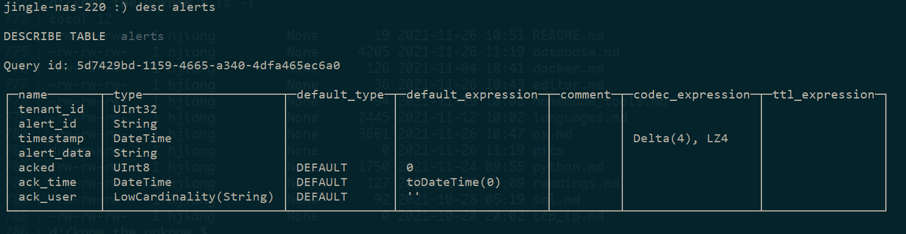
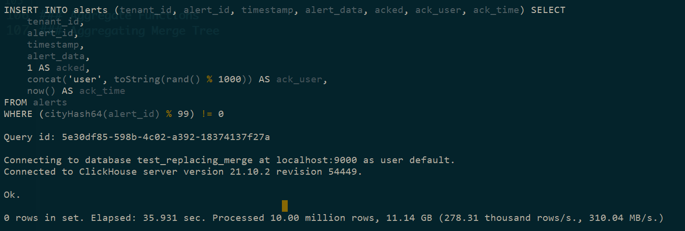
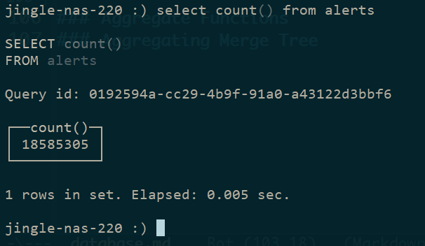
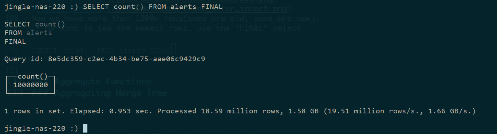

# 1. clickhouse
## 1.1 Some basic oprations
### install and start(debian)
sudo apt-get install apt-transport-https ca-certificates dirmngr  
sudo apt-key adv --keyserver hkp://keyserver.ubuntu.com:80 --recv E0C56BD4  
echo "deb https://repo.clickhouse.com/deb/stable/ main/" | sudo tee /etc/apt/sources.list.d/clickhouse.list  
sudo apt-get update  
sudo apt-get install -y clickhouse-server clickhouse-client  
clickhouse-client  

sudo service clickhouse-server start  
or  
sudo /etc/init.d/clickhouse-server start  

### allow remote mechine connect to this server
vim /etc/clickhouse-server/config.xml  
/search listen-host  
then uncomment the line  
### create a table
``` python
    create_query = '''
                    CREATE TABLE tutorial.frame_new_how
                    (
                        `EventTime` FixedString(19),
                        `Close` Float64,
                        `Open` Float64,
                        `Avg` Float64, 
                        `Field1` Float64,
                        `Field2` Float64,
                        `Field3` Float64,
                        `Field4` Float64,
                        `Field5` Float64
                    )
                    ENGINE = MergeTree()
                    PRIMARY KEY EventTime
                    ORDER BY (EventTime)
    '''
    create_res = client.execute(create_query)
    print(create_res)
```
### insert csv file into a table
clickhouse-client --password='jiang186212' --format_csv_delimiter="," --max_insert_block_size=100000  --query="INSERT INTO \ tutorial.frame_new_how FORMAT CSV" < frame.csv

### python package(clickhouse-driver)
pip install clickhouse-driver -i https://pypi.tuna.tsinghua.edu.cn/simple

### benchmark:
clickhouse-benchmark --query="select * from factor_database.factor_big_table1" -i 10 -h 192.168.222.220

### clickhouse-cpp build and install
git clone the code base  
mkdir build  
cd build  
cmake ..  
make  
sudo make install  

## 1.2 The real-time clickhouse
Since the updates in clickhouse are asynchronous, we can't see the updates of records in realtime.
So we have to insert a new modified record instead, and we must find a way to find the lastest one.

### Replacing Merge Tree
1. create a table use "ReplacingMergeTree" as the engine
```
CREATE TABLE alerts(
  tenant_id     UInt32,
  alert_id      String,
  timestamp     DateTime Codec(Delta, LZ4),
  alert_data    String,
  acked         UInt8 DEFAULT 0,
  ack_time      DateTime DEFAULT toDateTime(0),
  ack_user      LowCardinality(String) DEFAULT ''
)
ENGINE = ReplacingMergeTree(ack_time)
PARTITION BY tuple()
ORDER BY (tenant_id, timestamp, alert_id);
```
In the previous table, two "rows" with the same (tenant_id, timestamp, alert_id) will be regard as 
the same record, the "newer" version of the record will replace the old one. The 'newness' is 
determined by 'ack_time' in this case;



fill the table with some data:
```
INSERT INTO alerts (tenant_id, alert_id, timestamp, alert_data) SELECT
    toUInt32((rand(1) % 1000) + 1) AS tenant_id,
    randomPrintableASCII(64) AS alert_id,
    toDateTime('2020-01-01 00:00:00') + (rand(2) % ((3600 * 24) * 30)) AS timestamp,
    randomPrintableASCII(1024) AS alert_data
FROM numbers(10000000)
```

Then change 90% rows, not update but insert new rows:
```
INSERT INTO alerts (tenant_id, alert_id, timestamp, alert_data, acked, ack_user, ack_time)
SELECT tenant_id, alert_id, timestamp, alert_data, 
  1 as acked,
  concat('user', toString(rand()%1000)) as ack_user,
  now() as ack_time
FROM alerts WHERE cityHash64(alert_id) % 99 != 0;
```
The insert result:



Now we have more than 1800w rows(some are old, some are new). If we want to see the newest rows, use the *FINAL* select
```
SELECT count() FROM alerts FINAL
```


select use one of primary key and filter
```
SELECT count(), sum(cityHash64(*)) AS data FROM alerts FINAL WHERE (tenant_id = 451) AND (NOT acked)
```


we can see, select with a primary key and a filter can much decrease the "searched rows".
why is it fast this time? The difference is in the filter condition. 
‘tenant_id’ is a part of a primary key, so ClickHouse can filter data before FINAL. 
In this case, *ReplacingMergeTree* becomes efficient.

### Aggregate Functions
Let's check the previous select again! 
```
SELECT count(), sum(cityHash64(*)) AS data FROM alerts FINAL WHERE (tenant_id = 451) AND (NOT acked)
```
Let see how we can use aggregate functions(聚集函数) to accelerate the select process.
check the "update insert query" again.
```
INSERT INTO alerts (tenant_id, alert_id, timestamp, alert_data, acked, ack_user, ack_time)
SELECT tenant_id, alert_id, timestamp, alert_data, 
  1 as acked,
  concat('user', toString(rand()%1000)) as ack_user,
  now() as ack_time
FROM alerts WHERE cityHash64(alert_id) % 99 != 0;
```
*acked* change from 0 to 1
*ack_user* change from '' t0 'userxxx'
*ack_time* change from 0 to Now
all change are "inscreasing", we can use *max* aggregate functions

```
SELECT count(), sum(cityHash64(*)) data FROM 
  SELECT tenant_id, alert_id, timestamp, 
    any(alert_data) alert_data, 
    max(acked) acked, 
    max(ack_time) ack_time,
    max(ack_user) ack_user
  FROM alerts
  GROUP BY tenant_id, alert_id, timestamp
WHERE tenant_id=451 AND NOT acked;
```
### Aggregating Merge Tree
```
DROP TABLE alerts_amt_max;
CREATE TABLE alerts_amt_max (
  tenant_id     UInt32,
  alert_id      String,
  timestamp     DateTime Codec(Delta, LZ4),
  alert_data    SimpleAggregateFunction(max, String),
  acked         SimpleAggregateFunction(max, UInt8),
  ack_time      SimpleAggregateFunction(max, DateTime),
  ack_user      SimpleAggregateFunction(max, LowCardinality(String))
)
Engine = AggregatingMergeTree()
ORDER BY (tenant_id, timestamp, alert_id);
```
The aggrating merge tree will keep data size smaller.

## 1.3 Access control in clickhouse
### 1.3.1 Enabling SQL-driven Access Control and Account Management
open */etc/clickhouse-server/users.xml*, find the following line:
<!-- User can create other users and grant rights to them. -->
<!-- <access_management>1</access_management> -->
uncomment the second line.  
then restart the clickhosue-server,  
sudo service clickhouse-server restart

### 1.3.2 Create admin user for the server:
1. admin user:
create user admin IDENTIFIED WITH plaintext_password BY 'Life123'
2. grant full permission to the admin user:
GRANT ALL ON *.* TO admin WITH GRANT OPTION
3. disable the *default* user:

### 1.3.3 create normal user by admin user:
1. create syntax:
```
CREATE USER [IF NOT EXISTS | OR REPLACE] name1 [ON CLUSTER cluster_name1]
        [, name2 [ON CLUSTER cluster_name2] ...]
    [NOT IDENTIFIED | IDENTIFIED {[WITH {no_password | plaintext_password | sha256_password | sha256_hash | double_sha1_password | double_sha1_hash}] BY {'password' | 'hash'}} | {WITH ldap SERVER 'server_name'} | {WITH kerberos [REALM 'realm']}]
    [HOST {LOCAL | NAME 'name' | REGEXP 'name_regexp' | IP 'address' | LIKE 'pattern'} [,...] | ANY | NONE]
    [DEFAULT ROLE role [,...]]
    [DEFAULT DATABASE database | NONE]
    [GRANTEES {user | role | ANY | NONE} [,...] [EXCEPT {user | role} [,...]]]
    [SETTINGS variable [= value] [MIN [=] min_value] [MAX [=] max_value] [READONLY | WRITABLE] | PROFILE 'profile_name'] [,...]
```
	
2. examples:
Create the user account mira protected by the password qwerty:
```
CREATE USER mira HOST IP '127.0.0.1' IDENTIFIED WITH sha256_password BY 'qwerty';
```
mira should start client app at the host where the ClickHouse server runs.

Create the user account john, assign roles to it and make this roles default:
```
CREATE USER john DEFAULT ROLE role1, role2;
```

Create the user account john and make all his future roles default:
```
CREATE USER john DEFAULT ROLE ALL;
```
When some role is assigned to john in the future, it will become default automatically.

Create the user account john and make all his future roles default excepting role1 and role2:
```
CREATE USER john DEFAULT ROLE ALL EXCEPT role1, role2;
```

Create the user account john and allow him to grant his privileges to the user with jack account:
```
CREATE USER john GRANTEES jack;
```

### 1.3.4 alter user access permissons:
Set assigned roles as default:
```
ALTER USER user DEFAULT ROLE role1, role2
```
If roles aren’t previously assigned to a user, ClickHouse throws an exception.

Set all the assigned roles to default:
```
ALTER USER user DEFAULT ROLE ALL
```
If a role is assigned to a user in the future, it will become default automatically.

Set all the assigned roles to default, excepting role1 and role2:
```
ALTER USER user DEFAULT ROLE ALL EXCEPT role1, role2
```

Allows the user with john account to grant his privileges to the user with jack account:
```
ALTER USER john GRANTEES jack;
```

### 1.3.5 drop and show users
```
DROP USER [IF EXISTS] name [,...] [ON CLUSTER cluster_name]
SHOW USERS
```

### 1.3.6 role in clickhouse
Role is a container for access entities that can be granted to a user account.
Role contains:
* Privileges
* Settings and constraints
* List of assigned roles
Privileges can be granted to a role by the GRANT query. To revoke privileges from a role ClickHouse provides the REVOKE query.

1. syntax:
```
CREATE ROLE [IF NOT EXISTS | OR REPLACE] name1 [, name2 ...]
    [SETTINGS variable [= value] [MIN [=] min_value] [MAX [=] max_value] [READONLY|WRITABLE] | PROFILE 'profile_name'] [,...]
```
2. Managing roles:
created --> assign to one user
admin can set default role to users

Set multiple default roles to a user:
```
SET DEFAULT ROLE role1, role2, ... TO user
```

Set all the granted roles as default to a user:
```
SET DEFAULT ROLE ALL TO user
```

Purge default roles from a user:
```
SET DEFAULT ROLE NONE TO user
```

Set all the granted roles as default excepting some of them:
```
SET DEFAULT ROLE ALL EXCEPT role1, role2 TO user
```
